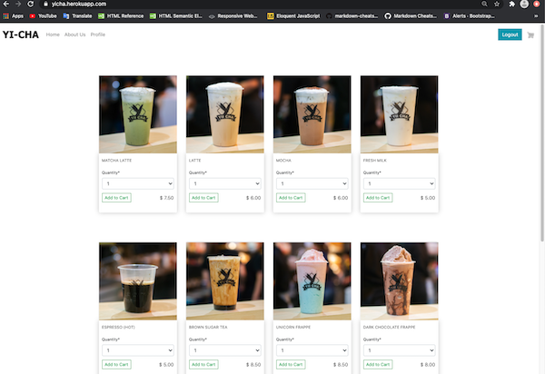
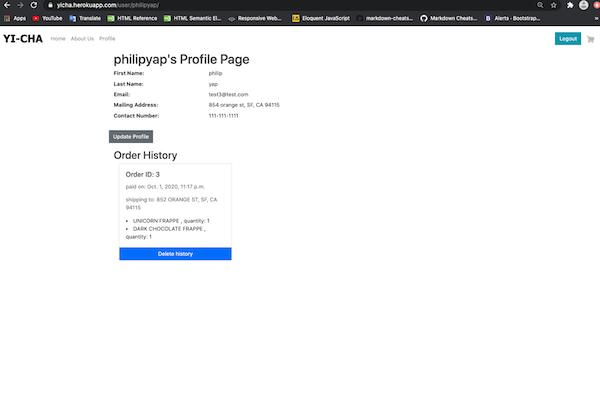
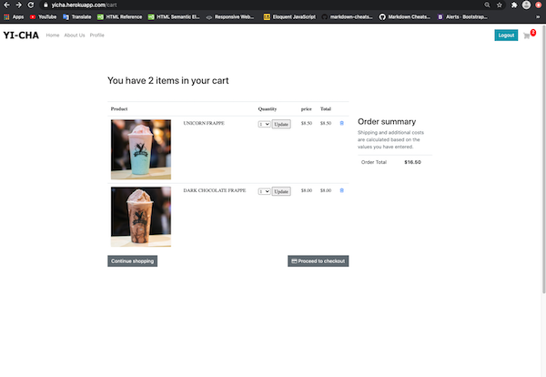
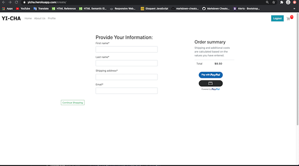
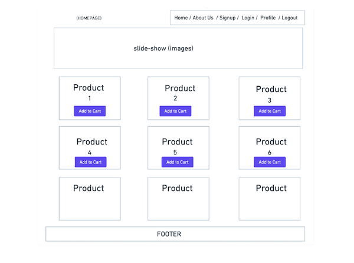
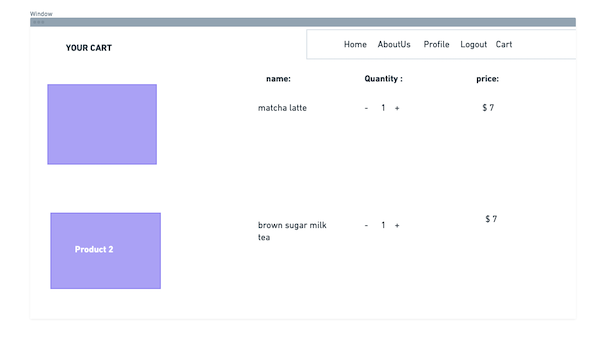
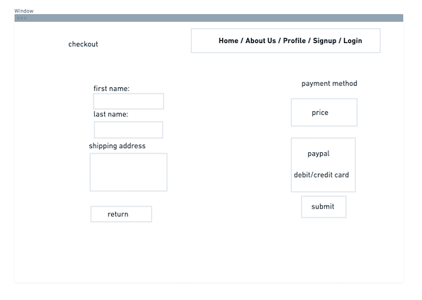
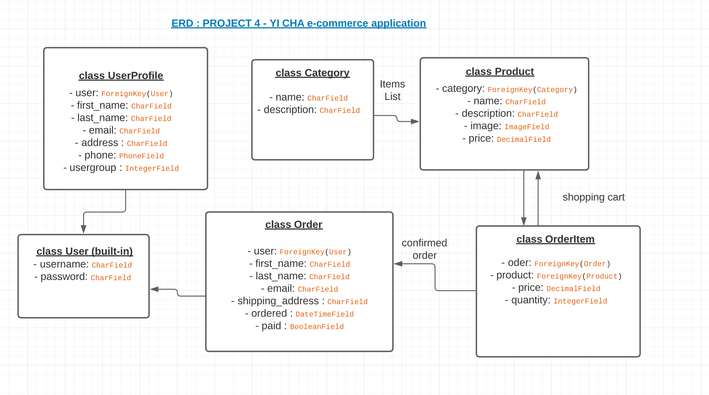

# Yi-Cha e-commerce app
## Introduction
This is an online ordering app developed in Django-3. Yi-Cha is a place for all tea lovers ! Yi-Cha means Japanese tea ceremony and it's ART of tea! Beyond just serving and receiving tea, one of the main purposes of the tea ceremony is for the guests to enjoy the hospitality of the host in an atmosphere distinct from the fast pace of everyday life. MAKE SURE you sign-up and log-in to shop around our app! Feel free to visit our site : [Welcome to Yi-Cha](https://yicha.herokuapp.com/)

## Technologies Used
- Django Framework, Python3
- PostGreSQL 
- HTML, Javascript
- CSS, Bootstrap 4.5

## User Stories
- User can view: menu, item list in shopping cart, and user profile info.
- User must login to access shopping cart and history details.
- User can create/edit items in shopping cart.
- User can create/edit own profile info.
- User can update or delete items in shopping cart brefore confirmation order.
- User can pay by Paypal once order confirmed. 
- Users able to check or delete their order history in profile page.

## Installation Instructions
1. Fork and clone the repository.
2. Setup virtual environment by:
```
    - pipenv shell
    - pipenv install django==3.0
```
3. Install requirements by:
```
    - cd requirements.txt
    - pip install -r requirements.txt
```
4. Add a .env file with SECRET_KEY set up.
5. Migrate Database
```
    - python3 manage.py makemigration
    - python3 manage.py migrate
```
6. Create Superuser
```
    - python3 manage.py createsuperuser
```
7. Run Server
```
    - python3 manage.py runserver
    goto browser : localhost:8000
```
8. Run Admin Site (superuser)
```
    localhost:8000/admin
```

## Website Pages

 
 
## Wireframes


## ERD



## Major hurdles of this app
## Backend
### 1. Shopping Cart: a shopping cart allows users to select the products they want and store them temporarily while they browse the site, until they eventually place an order. The cart has to be persisted in the session so that the cart items are kept during the user's visit. So we decided to use Django Session framework which session data is stored and cookies contain the session ID. The session middleware manages sending and receiving cookies.

In settings.py:
```python
INSTALLED_APPS = [
    #  .....
    'django.contrib.sessions',
    ]

MIDDLEWARE = [
    # ...
    'django.contrib.sessions.middleware.SessionMiddleware',
]
```
In cart.py:
```python
from django.conf import settings

class Cart(object):
  # __init__ setting user's requests to various parts of a web site
    def __init__(self,request):
        self.session = request.session
        cart = self.session.get(settings.CART_SESSION_ID)
        if not cart:
            # save an empty cart in the session
            cart = self.session[settings.CART_SESSION_ID] = {}
        self.cart = cart
```
In views.py:
```python
##### CART #####
def cart_detail(request):
  cart = Cart(request)
  for item in cart:
      item['update_quantity_form'] = CartAddProductForm(initial={'quantity': item['quantity'], 'update': True})
  return render(request, 'cart.html', {'cart': cart})

def cart_add(request, product_id):
  cart = Cart(request)
  product = get_object_or_404(Product, id=product_id)
  # update quantity in cart and 
  # set the form is valid then save the data by using form.cleaned_data
  form = CartAddProductForm(request.POST)
  if form.is_valid():
      cd = form.cleaned_data
      cart.add(product=product,quantity=cd['quantity'],update_quantity=cd['update'])
  return redirect('cart_detail')
  
def cart_remove(request, product_id):
    cart = Cart(request)
    product = get_object_or_404(Product, id=product_id)
    cart.remove(product)
    return redirect('cart_detail')
```
### 2. Creating customer orders: We need to use the order models to persist the items contained in the shopping cart when the user finally wishes to place an order. The functionality for creating a new order will work as follows: We present users an order form to fill in their data. We create a new Order instance with the data entered by users, and then we create an associated OrderItem instance for each item in the cart. We clear all the cart contents and redirect users to a success page.
In cart.py:
```python
from django import forms

class OrderCreateForm(forms.ModelForm):
    class Meta:
        model = Order
        fields = ['first_name', 'last_name', 'shipping_address','email']
```
In views.py:
```python
##### ORDER #####
def order_create(request):
  cart = Cart(request)
  user = User.objects.get(username=request.user.username)
  # if post, then goto form
  if request.method == 'POST':
    # POST request the validates data and store it in Order database
    order = Order.objects.create(user=user, first_name=request.POST['first_name'], last_name=request.POST['last_name'], shipping_address=request.POST['shipping_address'], email=request.POST['email'])
    # POST OrderItem iterate over the cart items
    for item in cart:
      OrderItem.objects.create(order=order, product=item['product'], price=item['price'], quantity=item['quantity'])
      # clear cart info once created OrderItem
    cart.clear()
    # render to checkout page once OrderCreateForm created
    return render(request, 'checkout.html', {'order': order})
  
  else:
    form = OrderCreateForm()
  return render(request, 'order.html', {'cart': cart, 'form': form})
```
## Frontend
### 3. Profile page: we decided to grab 4 models data - User, Order, OrderItem and UserProfile show in user's profile page. We extremely had a bad time in path urls issue, rendering and unable to grab a correct data from database. Finally, we figured out the below solutions to handle it.

In urls.py: profile page = path('user/<username>')
```python
urlpatterns = [
    #....
    path('user/<username>/', views.profile, name='profile'),
    path('user/<username>/<int:pk>/create', views.ProfileCreate.as_view(), name='profile_create'),
    path('user/<username>/<int:pk>/update/', views.ProfileUpdate.as_view(), name='profile_update'),
    path('user/<username>/<int:pk>/delete', views.OrderDelete.as_view(), name='order_delete'),
]
```
In views.py: 
```python
def profile(request, username):
    user = User.objects.get(username=username)
    # print(user.id)
    order = Order.objects.filter(user=user)
    user_profile = UserProfile.objects.filter(user=user)
    print(user_profile)
    # for icon cart length
    cart = Cart(request)
    for item in cart:
      item['update_quantity_form'] = CartAddProductForm(initial={'quantity': item['quantity'], 'update': True})
    
    return render(request, 'profile.html', {'user': user, 'username': username, 'order': order, 'cart': cart, 'user_profile': user_profile})
```
In profile.html: 
#### - refer to print(user_profile) in views.py, print out message is <QuerySet [<UserProfile: 1>]>. It's a dictionery/array so that we have grab the data's element as 0 plus what data we want. 
```html
<dt class="col-sm-3">First Name: </dt>
    <dd class="col-sm-9">{{ user_profile.0.first_name }}</dd>
    
<dt class="col-sm-3">Last Name:</dt>
    <dd class="col-sm-9">{{ user_profile.0.last_name }}</dd>
```
#### - the below solution is how we handle Create and Edit profile details. When a user_profile never set at all, it will show create button. 
```html

        <div class="left-col"><a href="" class="btn btn-secondary">Update Profile</a></div>
  
    
        <div class="left-col"><a href="" class="btn btn-danger">Create Profile</a></div>

```
#### - last part of profile page is rendering Order and OrderItem which has associate relation between two models. 
```html

        <div class="card-body">
        <blockquote>
          <h5 class="card-title">Order ID: {{ o.id }}</h5>
          
            <p>paid on: {{o.ordered_date}}</p>
          
            <p>shipping to: {{ o.shipping_address }}</p>
        </blockquote>
          
          <li>{{ i.product.name }} , quantity: {{ i.quantity}}</li>
          
        </div>
        <a class="btn btn-primary" href="">Delete history</a>

```

#### 4. Payment method: we decided to use [PayPal](https://developer.paypal.com/docs/business/javascript-sdk/javascript-sdk-reference/#buttons), to complete the transaction, and [sandbox account](https://developer.paypal.com/docs/api-basics/sandbox/accounts/#create-and-manage-sandbox-accounts), for developers to create personal(client) and business(employer) accounts to test the transaction. When user confirmed order and click PAY in PayPal, it'll automatically send the order and render to checkout.html.
In order.html:
```html
<div class="btn btn-outline btn-sm" id="paypal-button-container">
                <script src="https://www.paypal.com/sdk/js?client-id=AWP4AChFP3h8_V0nZ4k9fcv9FDlKgK59j01m5qXVFz_rym-zIuBuiPpaBZ5M2QACxvbW9oG5G3K2qOjq&currency=USD&disable-funding=credit"></script>
                  <script>
                    let total = '{{ cart.get_total_price }}'
                      // Render the PayPal button into #paypal-button-container
                      paypal.Buttons({
                        style: {
                          color: 'blue',
                          shape: 'pill',
                          label: 'pay',
                          height: 40,
                        },
                        // Set up the transaction
                        createOrder: function(data, actions) {
                          return actions.order.create({
                            purchase_units: [{
                              amount: {
                                value: parseFloat(total).toFixed(2)
                              }
                            }]
                          });
                        },
                        // Finalize the transaction
                        onApprove: function(data, actions) {
                          return actions.order.capture().then(function(details) {
                            // Show a success message to the buyer
                            $('#payform').submit();
                            alert('Transaction completed by ' + details.payer.name.given_name + '!');
                          });
                        }
                      }).render('#paypal-button-container');
                  </script>
</div>
```

## CRUD
1. GET views.py : get those info from Models and render to profile page
```python
def profile(request, username):
    user = User.objects.get(username=username)
    # print(user.id)
    order = Order.objects.filter(user=user)
    user_profile = UserProfile.objects.filter(user=user)
    print(user_profile)
    # for icon cart length
    cart = Cart(request)
    for item in cart:
      item['update_quantity_form'] = CartAddProductForm(initial={'quantity': item['quantity'], 'update': True})
    
    return render(request, 'profile.html', {'user': user, 'username': username, 'order': order, 'cart': cart, 'user_profile': user_profile})

```
```python
def product_details(request, product_id):
  # Calls get() on a given model manager
    product = Product.objects.get(id=product_id)
  # for icon cart length
    cart = Cart(request)
    for item in cart:
      item['update_quantity_form'] = CartAddProductForm(initial={'quantity': item['quantity'], 'update': True})
  
    return render(request, 'product.html', {'product': product, 'cart': cart})
```
2. CREATE views.py : using class(CreateView) to let users able to create their own info and render in profile page
```python
class ProfileCreate(CreateView):
    model = UserProfile
    fields = ['first_name', 'last_name', 'phone', 'email','address']
    
    def get_success_url(self):
        return '/user/'+self.request.user.username+'/'

    def form_valid(self,form):
        self.object = form.save(commit=False)
        self.object.user = self.request.user
        self.object.usergroup = 0
        self.object.save()
        return redirect('profile', self.request.user.username)

```
3. UPDATE views.py : using class(UpdateView) to let users able to edit their own info
```python
class ProfileUpdate(UpdateView):
    
    model = UserProfile
    fields = ['first_name', 'last_name', 'phone', 'email', 'address']

    def get_object(self, queryset=None):             
      return UserProfile.objects.get(user=self.request.user)

    def form_valid(self, form):
        print(self.request)
       # this will allow us to catch the pk to redirect to the show page
        self.object = form.save(commit=False) # don't post to the db until we say so
        self.object.save()
        return redirect('profile', self.request.user.username)
```

4. DELETE views.py : using class(DeleteView) to let users able to delete their order histories
```python
class OrderDelete(DeleteView):
    model = Order

    def get_success_url(self):
        return '/user/'+self.request.user.username+'/'

```